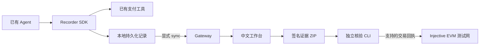

# BLACK BOX

**AI Agent 支付的证据层 · Verifiable evidence for agent payments**

Agent 调用支付工具后，成功返回、发生异常和结果未知都需要留下记录。BLACK BOX 将付款请求、工具结果和关联材料整理为可导出的签名证据，供开发者、交易双方和复核人员核对。

例如：Agent 购买一份报告，链上转账已经成功，程序却在返回结果前报错。BLACK BOX 保留付款请求与未知状态；开发者查询原交易后补充回执，就能说明钱是否转出，避免直接重付。

本仓库包含可自托管的 SDK、收集服务、中文工作台、证据导出、独立核验 CLI，以及独立的 Injective EVM 测试网受控工作流。代码和包中的 `AFR` / `@afr/recorder` 沿用早期名称 Agent Flight Recorder。

## 功能与范围

| 能力 | 当前实现 |
| --- | --- |
| 接入已有 Agent | Node/TypeScript SDK 包装已有支付函数；显式映射与同步事件 |
| 成功、异常与未知结果留证 | 付款前持久化请求，记录工具结果；未知结果通过查询原渠道后补充回执 |
| 查看与导出 | 工作台展示运行时间线；无需等待 AI 分析或审核即可下载当前签名快照 |
| 独立核验 | CLI 检查格式、文件摘要、签名者和签名；支持已配置 Injective 测试网资产的交易回执 |
| 受控测试网工作流 | 授权承诺上链 → 真实模型调用工具并付款 → AI 证据分析 → 人工复核 → 可选测试资产恢复 → 最终证据包上链 |

**两条路径的范围不同。** 外部 SDK 提供记录、同步和签名快照；它不会自动对所有外部 Agent 做事故归因、上链存证或赔付。完整 AI 分析和最终承诺上链属于受控测试网工作流。

当前面向本机、单租户、合成数据与测试资产的 MVP。尚未提供公网多租户托管、硬件 TEE、正式保险服务或通用支付渠道回执适配。签名和摘要可以核对披露材料是否被改动，不能单独证明输入事实真实、采集完整或 AI 判断正确。

## 快速开始：本地记录与导出

需要 **Node.js 22** 和 **pnpm 9.12.0**。这一模式不需要 MetaMask、模型 API、钱包充值或合约部署。

```sh
git clone https://github.com/er-s-an/AIX_blackbox.git
cd AIX_blackbox
pnpm install --frozen-lockfile
pnpm setup:local --recorder-only
pnpm build
pnpm build:cli
pnpm build:recorder
pnpm start:recorder
```

打开 [本地工作台](http://localhost:4310)，使用本次安装在 `.secrets/gateway.env` 中生成的 `USER_PASSWORD` 登录。进入「接入 Agent」创建接入，获取 `agentId` 和采集凭证。

初始化会生成属于本实例的私钥与 CLI 信任配置。只在新工作目录初始化；保留自己的 `.secrets/` 和信任配置，以便继续核验旧证据。服务默认只监听本机回环地址。

### 将现有支付工具接入 SDK

SDK 安装在 Agent 项目中，无需上传 Agent 源码。构建后的 tgz 可直接安装，不依赖 npm 公共发布：

```sh
# 在你自己的 Agent 项目中运行，替换为实际绝对路径
npm install /absolute/path/AIX_blackbox/dist/afr-recorder-0.2.0-beta.1.tgz
```

```ts
import { createRecorder } from '@afr/recorder';

const recorder = createRecorder({
  directory: './.afr',
  agentId: process.env.AFR_AGENT_ID!,
  runId: 'order-001',
  endpoint: 'http://localhost:4311',
  token: process.env.AFR_TOKEN!,
});

const pay = recorder.wrapPayment(existingPaymentFunction, {
  operationId: args => args.orderId,
  request: args => ({ order_id: args.orderId, amount: args.amount }),
  result: result => ({ receipt: result.receipt }),
});

try {
  // 将包装后的 pay 注册到你已有的 Agent 工具集合。
  await yourAgent.run({ pay });
} finally {
  try { await recorder.sync(); }
  finally { recorder.close(); }
}
```

`existingPaymentFunction` 和 `yourAgent.run` 是已有应用的示意接口。完整示例见 [外部 Agent](examples/external-agent.ts)，字段映射、回执格式、容量和隐私边界见 [SDK 指南](docs/product/SDK-GUIDE.md)。

SDK 先写本地记录，显式调用 `sync()` 后工作台才会收到事件。支付函数报错不等于交易失败：先查询原渠道，取得回执后调用 `recorder.reconcile(operationId, receipt)` 并同步。同一 `operationId` 不会自动再次执行付款。

### 下载并独立核验

在工作台打开运行详情，点击「下载当前证据」。将 ZIP 交给接收者，并通过可信渠道提供对应实例的 CLI 和公开信任配置；无需交付私钥。

```sh
pnpm exec node dist/afr-verify/afr-verify.mjs /absolute/path/evidence.zip --json

# 离线检查文件与签名；需要链上查询的项目会显示 Unknown
pnpm exec node dist/afr-verify/afr-verify.mjs /absolute/path/evidence.zip --offline --json
```

整个 `dist/afr-verify/` 目录可以复制到另一台有 Node 22 的机器上，以 `node afr-verify.mjs ...` 执行；无需 Gateway、数据库或模型 API。

| CLI 退出码 | 含义 |
| --- | --- |
| `0` | 所声明范围内的关键检查通过 |
| `1` | 检查失败，例如文件或签名不匹配 |
| `2` | 格式拒绝 |
| `3` | 材料不完整，或某些项目尚不可核验 |

记录器快照 `afr-snapshot/1` 整体为 `incomplete`，即使其文件、签名和支持的回执分别通过。这是快照的范围标记；它不具备完整最终案件包的所有材料。受控流程的最终包使用另一个严格核验格式。

## 为什么需要 AI 与 Web3

**AI 承担执行和分析。** 外部示例由真实模型选择订单与支付工具；受控工作流还会结合授权、供应商输入与交付结果，生成带证据 ID 和原文引用的分析。金额、签名及重复执行等硬条件由代码规则检查。

**区块链提供平台之外的核对点。** 测试网交易回执用于核对付款；受控工作流把授权和最终证据的承诺登记到链上，供另一方查询。原始证据保存在链下。外部 SDK 快照本身不自动上链。

这对应 AI × Web3 / Fintech 的基础设施场景：让 Agent 支付在成功、异常或争议时都有可交付的证据，为对账、人工复核和未来的保险接入提供材料。

## 架构



| 目录 | 职责 |
| --- | --- |
| `apps/web` | Next.js 中文工作台 |
| `apps/gateway` | 采集、案件存储、快照与受控工作流 API |
| `apps/operator`、`apps/verifier-svc` | 独立审核执行与软件声明服务 |
| `packages/recorder` | Node/TypeScript Recorder SDK |
| `packages/verifier-cli`、`packages/snapshot` | 独立核验与签名快照 |
| `packages/agent`、`packages/evalkit` | 模型工具调用、证据分析与评测 |
| `contracts` | EvidenceAnchor、ClaimVault 与 AFRTestUSD 测试合约 |
| `schemas`、`fixtures` | 数据规范与合成测试夹具 |
| `scripts` | 构建、启动、验收和消融实验 |

## 受控测试网工作流

这条路径需要额外的测试钱包、测试 INJ 和模型 API，独立于前面的 recorder-only 快速开始。请使用另一个全新工作目录：

1. 安装依赖，将 `.env.example` 复制为忽略提交的 `.env.local`，填写自己的测试网 `DEPLOYER_PK`、`AI_BASE_URL`、`AI_API_KEY`、`AI_MODEL`。
2. 执行 `AFR_SOURCE_ENV="$PWD/.env.local" pnpm setup:local`，生成属于本实例的角色密钥。
3. 准备下节的 Foundry 与 `forge-std`，执行 `pnpm test:contracts` 编译合约。
4. 执行 `pnpm deploy:testnet --fresh` 部署本实例合约，然后 `pnpm dev` 启动工作台与服务。
5. 在工作台连接测试钱包、签署授权、运行采购、分析证据并进行人工复核，最后导出与核验最终包。

链 ID 固定为 **1439**，演示资产为 **AFR-TEST-USD**。仓库中的 [部署记录](deployments/injective-testnet.json) 是既有测试实例的公开地址；新生成的角色密钥不能直接操作旧实例的 Vault。

`pnpm deploy:testnet`、`pnpm live`、`pnpm eval` 和 `scripts/external-agent-check.ts` 会产生实际测试网交易或模型请求。测试数据为合成输入；软件测试账户签名与自动审核不代替真人 MetaMask 和人工复核验收。部分场景刻意采用信任供应商路由指令的配置，用来研究故障后的证据链。

## 开发与验证

合约测试使用默认安装位置 `~/.foundry/bin/forge`。准备好 Foundry 后，安装固定版本的测试库：

```sh
git clone --depth 1 --branch v1.9.7 https://github.com/foundry-rs/forge-std contracts/lib/forge-std
pnpm test                 # 单元测试 + Foundry 合约测试
pnpm build                # TypeScript + Next.js production build
pnpm test:cold            # 新目录、新密钥、实际 SDK tgz 安装、采集与核验
pnpm test:ablation        # 临时目录对照：去重、先留请求记录、签名拒绝
```

冷安装和默认消融检查不调用模型、不部署合约、不付款。`pnpm negatives` 等历史回归脚本需要原始归档包与对应信任配置；这些私有运行目录不随源码分发。

本次上传前重新通过了 35 项单元测试、10 项合约测试、生产构建、冷安装与三项本地消融，见 [源码验证记录](docs/validation/PUBLICATION-2026-09-06.md)。此前的真实模型调用和 0.01 测试资产付款后异常、对账流程见 [Beta 验收记录](docs/product/BETA-RESULTS.md)；历史结果的时间、版本及未完成项保留原始范围，不代表每次克隆都会自动重跑真实交易。

## 数据与信任边界

- SDK 只记录被包装和显式提交的事件，不能证明绕过包装器的调用不存在。
- SDK spool 使用本地文件权限保护；服务端案件存储加密。只映射必要字段，避免写入凭证或个人金融数据。
- `.secrets/`、`.runtime/`、`.afr/`、`runs/` 和构建产物不进入版本控制。备份自己的密钥与运行数据，不用新密钥替换旧实例后继续声称同一信任来源。
- 当前没有正式保险承保、自动责任认定、主网资金保障或硬件可信执行声明。

## License

[MIT](LICENSE).
